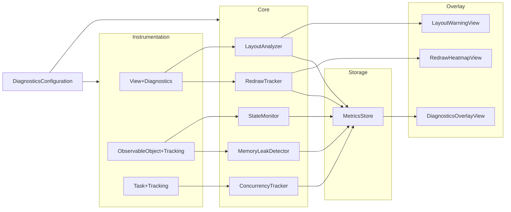

# SwiftUIDiagnosticsKit Architecture

## Overview

The framework is split into **Core** (trackers), **Instrumentation** (view and object hooks), **Storage** (events), **Config** (configuration and runtime), and **Overlay** (debug UI).

## Data Flow

- **Instrumentation** records into **Core** actors (RedrawTracker, LayoutAnalyzer, etc.).
- Core actors push events (breaches, warnings, violations) into **MetricsStore**.
- **Overlay** views read from Core and MetricsStore to display live data and lists.

## Modules

### Core

- **RedrawTracker** (actor): Per-view body invocation count, timestamps for redraws/sec, cause, threshold breach → MetricsStore.
- **LayoutAnalyzer** (actor): Per-view layout pass count and recent sizes; oscillation and loop detection; warnings → MetricsStore.
- **MemoryLeakDetector** (actor): WeakRef-based object registry, expected dealloc time, suspected leak list.
- **StateMonitor** (actor): State change log, redundant-update count, MainActor violations.
- **ConcurrencyTracker** (actor): Task registration, completion/cancel, long-running and MainActor violation events.

### Instrumentation

- **View+Diagnostics**: `DiagnosticsViewModifier` assigns a stable view ID, records body invocations (RedrawTracker), applies layout PreferenceKey and feeds LayoutAnalyzer, checks redraw/layout thresholds.
- **ObservableObject+Tracking**: `DiagnosticsObservableObject` wraps an `ObservableObject`, registers with MemoryLeakDetector, subscribes to `objectWillChange` for StateMonitor.
- **Task+Tracking**: `diagnosticsTrackedTask` creates a Task and registers it with ConcurrencyTracker, completes on finish.

### Storage

- **MetricsStore** (actor): Append-only in-memory `DiagnosticEvent` list, cap at `maxStoredEvents`, `exportJSON()` for session export.

### Config

- **DiagnosticsConfiguration**: Feature flags and thresholds (redraw, layout, leak, task, etc.).
- **Diagnostics**: Static API for `start`, `stop`, `exportMetrics`, `isActive`, `currentConfiguration`.
- **DiagnosticsRuntime**: Coordinates MetricsStore config, tracker resets, and performance sampling on start/stop.

### Overlay

- **DiagnosticsOverlayView**: Floating panel with summary (redraws, layout warnings, leaks, tasks, memory, state violations), toggles, and periodic refresh.
- **RedrawHeatmapView**: List of view IDs with redraw count and rate, colored by intensity.
- **LayoutWarningView**: List of layout warnings (high pass count, oscillation).

## Extension Points

- **Thresholds**: Adjust via `DiagnosticsConfiguration` (redrawThresholdPerSecond, layoutLoopThreshold, leakTimeout, etc.).
- **Export**: Use `Diagnostics.exportMetrics()` and parse the JSON; add filters or backends by wrapping or replacing the export step.
- **Callbacks**: RedrawTracker supports `setOnThresholdBreach` for custom handling of redraw breaches.
- **Remote toggle**: Control `Diagnostics.start` / `Diagnostics.stop` from a feature flag or remote config for internal builds.

## Thread Safety

- All shared state lives in **actors** (RedrawTracker, LayoutAnalyzer, MemoryLeakDetector, StateMonitor, ConcurrencyTracker, MetricsStore).
- Instrumentation calls into these actors from the main thread (SwiftUI) or from tasks; no raw locks in app-facing API beyond Diagnostics’ lock for start/stop.

## Debug vs Release

- With the default package setup, `SWIFTUI_DIAGNOSTICS` is defined only for **Debug** configuration.
- In Release, the public `Diagnostics` API is no-op (isActive = false, start/stop/export do nothing) unless you enable instrumentation via `DiagnosticsConfiguration.useInRelease` and ship a build that calls `Diagnostics.start(config:)`.
